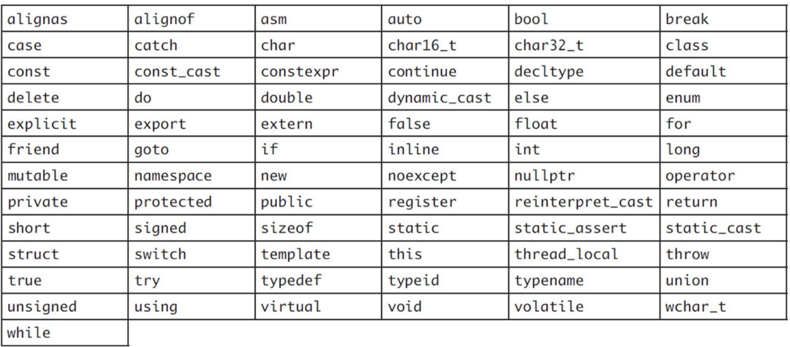
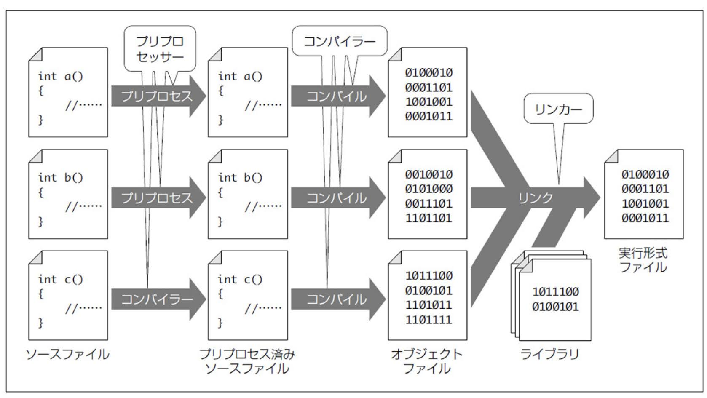

# 分割コンパイル・ビルド
ここでは，1ファイルに収まらないほど大きなプログラムを書くにあたって，注意すべき事項について取り扱う．

## 識別子と C++ のキーワード
識別子とは関数や型，変数などの名前に相当するもののこと．

### 識別子のルール
識別子は半角英数字とアンダースコア (_) の組み合わせで構成される．
識別子には次のようなルールがある．

- アルファベットの大文字と小文字は区別する (A と a は別物)
- 先頭を数字にすることはできない (123foo のような変数名はダメ)
- アンダースコアで始まっても問題はないが注意は必要

アンダースコアの扱いについては，

- アンダースコアが2つ以上連続した部分を含むもの
- 安打スコアで始まり，大文字のアルファベットが1つ以上続くもの
- グローバル名前空間でアンダースコアから始まるもの

は予約語となっているので，プログラマは使うことができない．

識別子の命名には次の3つの規則があり，いずれを使ってもよいが，同じプロジェクト内では揃えた方が良い．

1. スネークケース  
   単語と単語をアンダースコアでつなげる (snake_case)
2. アッパーキャメルケース  
   各単語の最初の文字を大文字にして，残りは小文字のままつなげる (UpperCamelCase)
3. ローワーキャメルケース  
   先頭の単語のみ全て小文字にして，残りをアッパーキャメルケースでつなげる (lowerCamelCase)

### C++ で定義されているキーワード
C++ には次のようなキーワードが設定されており，これらはユーザが変数名などに使うことはできない．



### 文脈依存キーワード
```final``` や ```override``` は記述された位置によっては特別な意味を持つ．
ユーザが自由に使うことができるが，混乱を招く原因になるので可能な限り使用は避ける．

### 代替表現
キーワードでも文脈依存キーワードでもなく，他のものに置き換わることが決まっている識別子のこと．
こちらもできるだけ使用は避ける．


### 暗黙的に定義される識別子
プログラム自体に関するメタ情報を表す識別子が存在する．

| 識別子 | 型 | 内容 |
| :--: | :--: | :--: |
| \_\_FILE__ | 文字列リテラル | ソースファイル |
| \_\_LINE__ | 数値リテラル | ソースコード内で出現した位置の行番号 |
| \_\_func__ | 文字型の配列 | 出現した位置の関数名 |
| __cplusplus | 数値リテラル | 参照している C++ のバージョン |

## 宣言と定義
### 宣言
宣言は変数や関数，クラスなどがどういった名前でそこにあるかを伝えるためのもの．
関数を前方宣言をしておくことで，プログラムの後ろの方に関数を定義しても，呼び出すことができるようになる．

```cpp
// 関数宣言 (プロトタイプ宣言)
return-type function-name(parameters...);
// 構造体宣言
struct struct-name;
// クラス宣言
class class-name;
// 共用体宣言
union union-name;
// 列挙体宣言
enum class enum-name;
// 列挙体宣言 (基底の型付き)
enum class enum-name : underlying-type;
```

### 定義
関数やクラスの中身がどうなっているのかを記述すること．
定義には宣言に必要な要素が全て含まれているため，(1ファイルに収まるプログラムなら)
定義だけでも問題なくコンパイルできる．
しかし，分割コンパイルをする場合など，宣言をヘッダーファイルに記述し，定義をソースコードに記述する必要がある．

### クラス定義中のメンバー関数定義
クラスのメンバ関数はクラスの定義内に直接書くことができる．
```return``` 文しかないような2〜3行程度の短い関数の場合，わざわざ宣言と定義を分けるのは億劫なので，
クラス内で同時に定義しても良い．
ただし，複雑な処理をクラス内に定義すると，プログラムの見通しが悪くなるので，クラス内では宣言のみに留めるべきである．


## スコープ
スコープとは変数の有効範囲のこと．
スコープ外では変数を参照できず，変数は破棄される．  
変数はスコープの中でしか有効にならず，この有効になっている期間のことを生存期間や寿命と呼ぶ．
また，特定のスコープ内にある変数のことをローカル変数と呼ぶ．

### 関数スコープ
関数スコープは開きブレース ( "{" ) から閉じブレース ( "}" ) までのこと．
関数スコープ内で宣言された変数と関数の仮引数は，関数から呼び出し元に処理が戻るときに破棄される．

### その他のスコープ
```if``` 文や ```for``` 文などのブレースもスコープを構成する．
また，単にブレースで加工だけでもスコープだ作られる．
このようにして作られた異なるスコープでは，同じ名前のローカル変数を定義できる．

### グローバル変数と static 変数
関数の外側のグローバルスコープで宣言された変数はグローバル変数と呼ばれ，```main``` 関数の呼び出し前から存在し，
```main``` 関数が終了したあとに破棄される．
このグローバル変数は全ての関数から使うことができる．  

ローカル変数を ```static``` 変数にすると，スコープから抜けても変数が破棄されず，プログラムの終了まで残り続ける．
一方，グローバル変数を ```static``` 変数にすると，ファイルスコープなグローバル変数になる．
これは，分割コンパイルをする際に必要となる．

```cpp
static type variable-name;
```

```static``` 変数の初期化は初回のみ行われ，2回目以降は実行されない．

### ダングリングポインタ
ローカル変数はスコープを抜けたときに破棄されるが，破棄される前に取得したアドレスを間違ってスコープ外に
持ち出してしまう可能性がある．
このように，破棄された変数を指しているポインタのことを，ダングリングポインタと呼ぶ．
ダングリングポインタを通して変数にアクセスしようとすると，プログラムがクラッシュしたり，
最悪，他のデータを破壊しながら暴走したりする．


## 初期化構文付き条件分岐

### 初期化構文付き if 文
関数などの戻り値を使った条件分岐を行う際，通常では戻り値を一旦変数に格納してやる必要があるが，
初期化構文付き if 文を使えば，その操作を一括して処理できるようになる．

```cpp
if (type-name variable-name = expression; condition) {
   if-statement-body
   ...
} else {
   else-statement-body
   ...
}
```

これは以下の ```if``` 文と等価である．
```cpp
type-name variable-name = expression;

if (condition) {
   if-statement-body
   ...
} else {
   else-statement-body
   ...
}
```

複数回，関数を呼び出すことによる予期しない挙動の防止や，変数のスコープ制御に有用である．


### 初期化構文付き switch 文
```cpp
switch (type-name variable-name = expression; condition) {
   switch-statement-body
   ...
}
```


## 分割コンパイル
### コンパイル
コンパイルとはソースファイルをコンピュータが実行できる形式(実行形式ファイル)に変換すること．
コンパイルを行うソフトウェアをコンパイラと呼ぶ．

### プリプロセス
コンパイルの前には，ヘッダファイルの読み込みやマクロの展開などの前処理を行う．
これをプリプロセスと呼び，プリプロセスを行うプログラムをプリプロセッサと呼ぶ．

### リンクとビルド
機能ごとに複数のファイルにソースファイルを分割し，そこから1つのプログラムを作成することをビルドと呼ぶ．  
正確にはコンパイルで生成されるのはオブジェクトファイルで，それ単体では実行できない．
ビルドでは，各ソースファイルからオブジェクトファイルを作成し，それらをリンカを使ってリンクすることで，
実行形式ファイルを生成している．  
リンクでは生成されたオブジェクトファイルだけでなく，標準ライブラリなど予め提供されている機能を使うための
ライブラリもリンクする．

具体的なビルドの手順は次の図のようになっている．


module.hpp：
```cpp
// ヘッダファイルに必要なのは関数宣言のみ
void show_value(int value);
```

module.cpp：
```cpp
// このソースファイルで使う宣言が含まれるためインクルードする
#include "module.hpp"
#include <iostream>

void show_value(int value)
{
   std::cout << "value = " << value << std::endl;
}
```

main.cpp：
```cpp
// 前方宣言を取り込む
#include "module.hpp"

int main()
{
   show_value(77);
}
```

```bash
$ g++ -c -o module.o module.cpp
$ g++ -c -o a.out main.cpp module.o
```

### extern 変数
ヘッダファイルや複数のソースファイルでグローバル変数を宣言していしまうと，各ソースファイルがコンパイルされたときに，
各オブジェクトファイルがグローバル変数の実体を持つようになってしまう．
すると，どれが本物なのか区別がつかなくなってしまうため，グローバル変数は特定ファイルで定義することにして，
他のファイルでは ```extern``` 変数としてグローバル変数を利用する．

```cpp
extern type-name variable-name
```

```extern``` 変数は「変数の存在」を宣言しているだけであるため，初期値を与えることはできない．

### static メンバ変数の定義
```static``` メンバ変数をヘッダファイルに書いてしまうと，各ソースファイルで実体が作られてしまい，
リンク時にどれが問ものなのか分からなくなってしまう．
そのため，```static``` メンバ変数の実体もどこか1つのソースファイルでのみ定義するようにする．


## インライン関数
### ヘッダファイルに定義された関数のインライン展開
多くの場合，クラスのメンバ関数であるか否かにかかわらず，プロトタイプ宣言をヘッダファイルに書いて，
その関数本体はソースファイルに記述する．
関数本体が非常に小さい場合，ヘッダに関数定義を書くことができれば，コンパイラは呼び出し元にその関数を
インライン展開することで，より深い最適化が可能．  
関数の処理が単純な場合には，関数内での処理よりも呼び出しのほうがコストが大きくなってしまうことがある．
そこで，関数での処理と同じ内容を呼び出し元で行い，関数呼び出しを省略することで最適化を行う．

### インライン指定
インライン関数を使うには，関数宣言の先頭に ```inline``` を付け加えるだけで良い．

```cpp
inline return-type function-name(parameters...);
```

インライン指定はインライン展開を強制するものではなく，複雑な関数をインライン指定しても，
通常の関数と同様に扱われることもある．
また，ヘッダファイルに関数を定義することは，厳密には単一定義規則に違反しているが，
インライン指定することでこれを回避する意味もある．

### 自動インライン化
クラス定義時にメンバ関数の宣言と定義を同時に行うことができる．
クラス定義全体の見通しを良くするため，クラス定義に記述するメンバ関数は1〜2行，長くて5行程度に抑える．
また，クラスの定義は多くの場合ヘッダファイルに記述されるが，クラスのメンバ関数としてヘッダファイルに書かれた関数は，
インライン指定をしなくても自動的にインライン関数になる．

### 宣言のみのメンバ関数をインラインにする
クラス定義で宣言のみ行ったメンバ関数は，自動的にインライン展開されないので，
インライン関数としてコンパイルしたい場合には，明示的に ```inline``` 指定を行う必要がある．

### メンバ関数の実装方法を選ぶヒント
クラス定義に getter 関数や setter 関数の定義を定義を含めることで，

- 自動インライン化の恩恵を受けられる
- メンバ変数と近い位置に定義されているためわかりやすい

といったメリットがある．  
一方で，大きな関数を自動インライン化のためにクラス定義内に書くのは避けるべきである．
クラス定義に関数の適宜を含めるか，宣言のみに留めるか，また，インライン指定するか否かは，
メンバ関数の目的や規模によって適宜選択する．


## 名前空間
### 名前空間とスコープ解決演算子
関数や変数，クラスには自由に名前を付けることができるが，同じ名前をつけた場合には，
エラーになったり，意図せずオーバーロードしてしまったりすることがある．
また，同じ名前を多用したプログラムは可読性が低下するため，名前の重複は基本的に避けるべきである．

しかし，実際に外部ライブラリを使ってプログラムを書く際に，名前が衝突しないことを確かめるのは難しい．
そこで，名前空間 (namespace) を使って名前の衝突を回避できる．

```cpp
namespace namespace-name
{
   namespace-body
   ...
}
```

名前空間内にある関数やクラスを使う場合には，スコープ解決演算子 (::) を使ってアクセスする．

```cpp
// 変数宣言
namespace-name::type-name variable-name;
// 関数呼び出し
namespace-name::function-name();
// 変数の使用
namespace-name::variable-name;
```

### ネストした名前空間
名前空間はその中に，さらに名前空間を持つことができる．
これによって，ライブラリの中で更に機能ごとに分けたり，内部実装用の名前空間と分けて必要な機能だけを外部に
公開したりできるようになる．

```cpp
namespace toplevel-namespace-name
{
   namespace nested-namespace-name
   {
      ...
   }
}
```

これは次のように省略した書き方もできる．

```cpp
namespace toplevel-namespace-name::nested-namespace-name
{  
   ...
}
```

### 名前空間の省略
C++ で関数を呼び出した時，まず呼び出し元の関数やクラスが属する名前空間から名前検索を開始し，見つからなければ1つ上位の名前空間を
起点として同様に検索を行う．
最終的にグローバル名前空間まで探索して見つからなければエラーとなる．

```using``` ディレクティブを使うことで，このディレクティブが宣言されているスコープ内に限って，
特定の名前空間を省略を指示できる．

```cpp
using namespace namespace-name;

using namespace namespace-name::nested-namespace-name;
```

次のように使う．
```cpp
namespace module::submodule
{
   void feature();
}

{
   using namespace module;
   submodule::feature(); // OK
}

submodule::feature() // スコープ外なのでエラー
```

```using``` 宣言は指定した名前のみを今のスコープで使えるようにする宣言である．

```cpp
using namespace-name::name;

using namespace-name::nested-namespace-name::name;
```

次のように使う．
```cpp
namespace module::submodule
{
   void featureA();
   void featureB();
}

{
   using module::submodule::featureA;
   featureA(); // OK
   featureB(); // エラー
}

featureA(); // スコープ外なのでエラー
```

また，なめ空間に別名を与えることもできる．

```cpp
namespace new-namespace-name = nested-namespace-name;
```

さらに，グローバル名前空間から絶対パスで名前空間を指定することもできる．
スコープ解決演算子で名前空間を指定しなければ，グローバル名前空間から検索が開始される．

```cpp
::namespace-name::name
```

### 無名名前空間
無名名前空間は，異なるソースファイルに存在する同じ名前を区別するための名前空間である．
他のソースファイルから意図せず呼び出してしまうことを防ぐために，
他のファイルと重複しない名前空間を用意するのは，用意自体が面倒で，名前も長くなってしまうという問題がある．

```cpp
namespace
{
   ...
}
```

無名名前空間の中に通常の名前空間を定義したり，逆に通常の名前空間の中に無名名前空間を定義することもできる．
この場合，無名名前空間の部分を飛ばして名前空間の指定ができる．


## リンケージ
### C 言語と C++
C 言語で書かれたプログラムを呼び出したり，C 言語側から C++ のプログラムを呼び出す場合に必要な機能が
リンケージである．
C++ 側でリンケージを指定することで，そのいずれもできるようになる．

```cpp
// C リンケージ：C 言語とリンクできる関数の宣言・定義
extern "C" return-type function-name(parameters...);

// C++ リンケージ：C 言語とリンクできない関数の宣言・定義 (デフォルト)
extern "C++" return-type function-name(parameters...);
```

### C リンケージの一括指定
範囲指定で一括してリンケージの指定も可能．

```cpp
extern "C"
{
   // ここに書かれたプロトタイプ宣言は C リンケージとなる
}
```


## プリプロセッサ
プリプロセッサはソースコードのコンパイルに先立って，ヘッダファイルとの結合やプログラムの一部無効化を行う．

### プリプロセッサ命令
プリプロセッサ命令(ディレクティブ)は，ハッシュ (```#```) で始まる命令で，プリプロセッサが行う処理を支持する
特別な命令である．
最もよく使われるプリプロセッサ命令は ```#include``` で，ヘッダファイルの読み込みを指示する．
```#include``` には以下のような2つの書式がある．

```cpp
#include <file-name>
#include "file-name"
```

両者の動作に大きな違いはなく，標準ライブラリには上の書式を，プロジェクトで作成したヘッダファイルの読み込みには
下の書式を用いることが多い．

ヘッダファイルの読み込みは，使っている場所よりも前で行う必要があるが，直前に行うとエラーになる場合もあるため，
基本的にソースファイルの先頭で行うようにする．

### マクロ
識別子を別の識別子に置き換える命令をマクロと呼ぶ．
プリプロセッサはマクロを見つけると，予め定義しておいた別のトークンに置き換えることで，
ソースコードそのものを変更する．

```cpp
#define macro-name

#define macro-name macro-replacement
```

マクロは前処理段階で処理されるため，名前空間やクラス，関数のスコープなどは認識されないまま処理される．
そのため，名前の重複が生じやすく，長めの名前に設定することが一般的である．  
また，マクロはコンパイル終了までずっと有効になるため，意図しない置き換えが生じる恐れがある．
そこで，マクロ定義を消す ```#undef``` 命令が用意されている．

```cpp
#undef macro-name
```

通常のマクロは識別子をそのまま別の文字列に置き換えるだけだが，引数を与えて置き換える文字列を変更できる
関数形式マクロもある．

```cpp
#define macro-name(macro-parameter-name, macro-parameter-name, ...)
#define macro-name(macro-parameter-name, macro-parameter-name, ...) macro-replacement 
```

関数形式マクロに簡単な処理を書いて，通常の関数のように呼び出すこともできるが，
ほとんどの場合でインライン関数を使うべきである．

### 結合と展開
- \#\# 演算子  
  前後のトークン列を結合する演算子
  ```cpp
  #define concatenate(left, right) left ## right
  concatenate(foo, bar) // => foobar に置き換わる
  ```

- \# 演算子  
  ダブルクォートで囲まれた文字列は置き換えの対象とならない．
  トークン列を文字列に置き換える場合には ```#``` 演算子を使う．
  ```cpp
  #define stringize(value) # value
  stringize(hoge) // => "hoge" に置き換わる
  ```

マクロ定義の中で他のマクロを使うこともできるが，展開される順番には注意が必要．

1. 引数を置き換える
2. \#\# 演算子や \# 演算子の処理
3. 引数に展開可能なマクロが含まれていた場合はそのマクロを展開する
4. 全部置き換えた結果，マクロがあったらそれを展開する

```cpp
#define cat(left,right) left ## right
#define stringize_I(value) # value
#define stringize(value) stringize_I(value)
#define complex_macro(left, right) stringize(cat(left, right))

complex_macro(foo, bar) // => "foobar" となる
```

上記の例では，

1. ```complex_macro``` が展開され引数を ```stringize(cat(foo, bar))``` に置き換える
2. ```stringize(cat(foo, bar))``` を ```stringize_I(cat(foo, bar))``` に置き換える
3. 引数が展開可能なマクロなので展開し ```stringize_I(foo ## bar)``` となる
4. \#\# 演算子によって結合され ```stringize_I(foobar)``` となる
5. 最後のマクロを展開し ```#foobar``` となる
6. \# 演算子を展開して ```"foobar"``` が得られる

### #if 命令
```#if``` / ```#elif``` / ```#else``` / ```#endif``` プリプロセッサを用いて，
プログラムの有効 / 無効を切り替えることができる．

```cpp
#if condition
   
   true-program...

#elif condition

   elif-program...

#else

   else-program...

#endif
```

よく使われる条件としては次のものがある．

| 条件式 | 意味 |
| :--: | :-- |
| 整数 | 0 が false，それ以外で true |
| 計算式 | 四則演算など整数のみで計算できるもの |
| defined(macro-name) | macro-name の名前が定義されていたら true，それ以外は false|
| macro-name | マクロを展開し再度条件式として評価 |

```__LINE__``` や ```__FILE__```，```__cplusplus``` などは条件に使うことができる．  
C 言語と共通化したヘッダファイルを作るときには，```__cplusplus``` と組み合わせた条件文がよく使われる．
ただし，```__cplusplus``` は C 言語では定義されていないので，C 言語と C++ で動作を買えたい場合には，
```defined()``` と組み合わせて切り替えることができる．
例えばリンケージの指定は次のように設定できる．

```cpp
#if defined(__cplusplus)
extern "C" {
#endif // C++ のときのみリンケージを指定

   // C 言語の処理

#if defined(__cplusplus)
} // リンケージ指定の終了
#endif
```

```#if defined()``` はよく使われるので，これをまとめた ```#ifdef``` や ```#ifndef``` が用意されている．

```cpp
// #if defined(macro-name)
#ifdef macro-name

// #if !defined(macro-name)
#ifndef macro-name
```

ただし，```#else``` や ```#elif``` を合わせて使う場合には，```#ifdef``` は使えない．

```#ifndef``` と ```define``` を組み合わせて，何度インクルードされても問題にならないように設定できる．
これを，インクルードガードと呼び，標準ライブラリやサードパーティ製のライブラリには施されている．

```cpp
#ifndef UNIQUE_IDENTIFIER
#define UNIQUE_IDENTIFIER

// ヘッダファイルの本体

#endif
```

1回目にインクルードされたときには，マクロで何も定義されていないので，```#ifndef``` のブロックが有効になるが，
2回目以降では ```#define``` で定義されたマクロが存在しているので，```#ifndef``` のブロックが無効となり，
ファイルの中身が取り込まれなくなる．